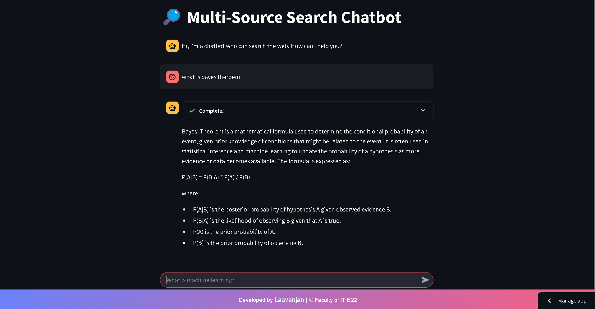
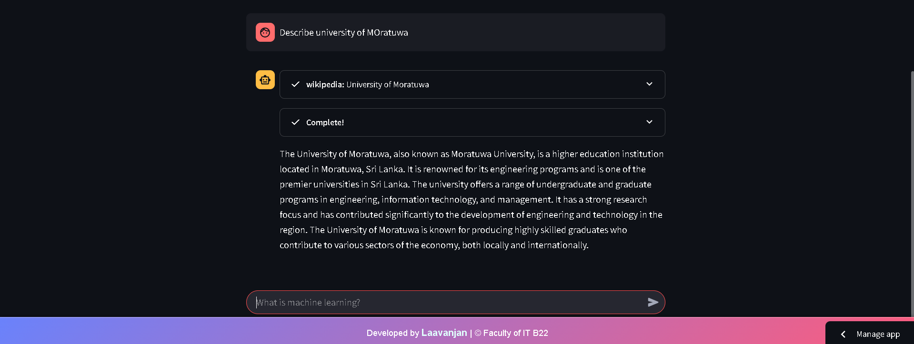
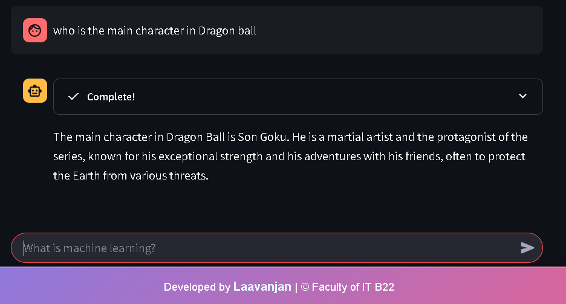
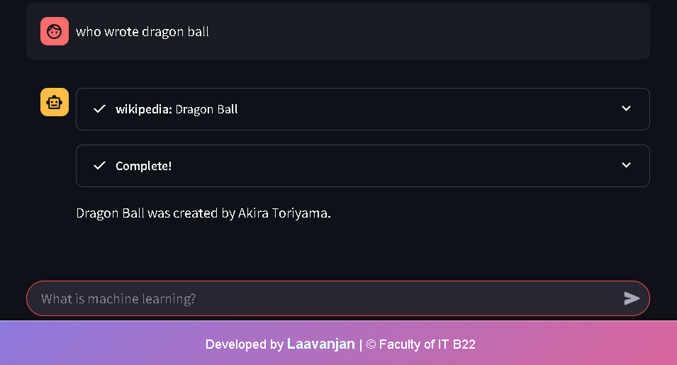
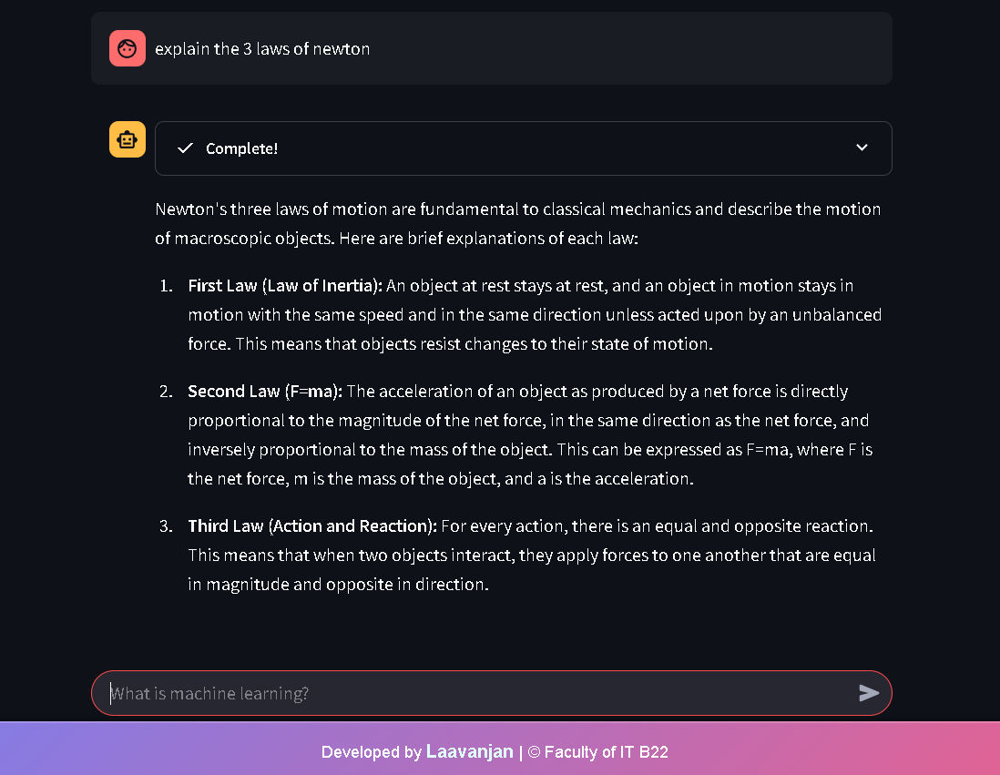

# 🔍 Search-LLM-deploy-streamlit 🚀

[](https://www.gnu.org/licenses/gpl-3.0)
[](https://www.python.org/downloads/release/python-390/)
[](https://streamlit.io/)
[](https://langchain.readthedocs.io/en/latest/index.html)
[](https://smith.langchain.com/)
[](YOUR_STREAMLIT_APP_URL)

**Search-LLM-deploy-streamlit** is a powerful Streamlit application 🤖 that combines the capabilities of Large Language Models (LLMs) with web search 🌐 and academic research tools 📚. It allows users to ask questions and receive comprehensive answers 💡, leveraging Groq's fast inference ⚡, DuckDuckGo search 🦆, Arxiv for academic papers 🔬, and Wikipedia for general knowledge 📖. This project demonstrates how to deploy an intelligent search agent using Streamlit and LangChain, with robust LangSmith tracing 🕵️‍♂️ for debugging and performance analysis.

**[Add a screenshot here! Replace with your image link or relative path.]**

## Table of Contents

- [Overview](#overview)
- [Features](#features)
- [Working Examples](#working-examples)
- [Live Demo](#live-demo)
- [Installation](#installation)
- [Usage](#usage)
- [How It Works](#how-it-works)
- [Technologies Used](#technologies-used)
- [LangSmith Tracing](#langsmith-tracing)
- [Environment Variables](#environment-variables)
- [License](#license)
- [Author](#author)
- [Contributing](#contributing)
- [Contact](#contact)

## Overview

This application provides an interactive chatbot interface 💬 for users to ask questions and receive answers based on information retrieved from the web 🌐, academic papers 📚, and Wikipedia 📖. It utilizes LangChain's agent capabilities to orchestrate the tools and Groq's LLM for generating responses 🧠. The integration of LangSmith enables detailed tracing 🕵️‍♂️ and debugging of the agent's actions, making it easier to understand and improve the application's performance 📈.

## Features

-   **Interactive Chatbot Interface:** User-friendly Streamlit interface 💬 for conversational interaction.
-   **Web Search Integration:** DuckDuckGo search 🦆 for real-time information retrieval 🌐.
-   **Academic Paper Search:** Arxiv API 🔬 for searching and summarizing research papers 📚.
-   **Wikipedia Integration:** Access to general knowledge 📖 through Wikipedia API.
-   **Groq LLM Integration:** Utilizes Groq's "qwen-2.5-32b" model for fast and accurate responses ⚡.
-   **LangSmith Tracing:** Comprehensive tracing 🕵️‍♂️ of agent actions for debugging and performance analysis 📈.
-   **Streaming Responses:** Real-time feedback and response generation using `StreamlitCallbackHandler` 🔄.
-   **Session State Management:** Maintains conversation history 📜 for a seamless user experience.

## Working Examples

| Image 1 | Image 2 | Image 3 |
|---------|---------|---------|
|  |  |  |
| What is Bayes theorem | Describe SriLanka | Describe University of Moratuwa |
| Image 4 | Image 5 | Image 6 |
|  |  |  |
| Who is the main character dragon ball | who wrote dragon ball | Explain the 3 laws of Newton |

## Live Demo

Try the live demo of the chatbot here:

[YOUR_STREAMLIT_APP_URL](https://search-llm-deploy-app-i9pedlvcogtb2wpnaeypde.streamlit.app/)

## Installation

1.  **Clone the repository:**

    ```bash
    git clone [https://github.com/laavanjan/Search-LLM-deploy-streamlit.git](https://www.google.com/search?q=https://github.com/laavanjan/Search-LLM-deploy-streamlit.git)
    cd Search-LLM-deploy-streamlit
    ```

2.  **Create a Conda virtual environment (recommended):**

    ```bash
    conda create -n search-llm-env python=3.9 -y
    conda activate search-llm-env
    ```

    * Replace `search-llm-env` with your desired environment name if needed.
    * Ensure you have Conda installed. If not, you can download it from [Anaconda's website](https://www.anaconda.com/products/distribution).

3.  **Install dependencies:**

    ```bash
    pip install -r requirements.txt
    ```

4.  **Set up your `.env` file with the required API keys:**

    ```
    GROQ_KEY=your_groq_api_key
    LANGCHAIN_API_KEY=your_langchain_api_key
    LANGCHAIN_PROJECT=your_langchain_project_name
    ```

## Usage

1.  **Run the Streamlit app:**

    ```bash
    streamlit run app.py
    ```

2.  **Open the application in your web browser.**

3.  **Enter your question in the chat input and press Enter.**

4.  **View the generated response in the chat interface.**

## How It Works

1.  The user enters a question in the chat input 💬.
2.  The application uses LangChain's agent framework to determine the appropriate tools to use (DuckDuckGo 🦆, Arxiv 🔬, Wikipedia 📖).
3.  The agent retrieves relevant information from the selected tools 🌐.
4.  Groq's "qwen-2.5-32b" model processes the retrieved information and generates a response 🧠.
5.  The response is displayed in the chat interface 🔄, with real-time streaming enabled by `StreamlitCallbackHandler`.
6.  LangSmith traces the agent's actions 🕵️‍♂️, providing detailed insights into the process 📈.

## Technologies Used

-   Python 🐍
-   Streamlit 💧
-   LangChain 🔗
-   Groq (qwen-2.5-32b) ⚡
-   DuckDuckGo Search API 🦆
-   Arxiv API 🔬
-   Wikipedia API 📖
-   LangSmith 🕵️‍♂️
-   dotenv 🔑

## LangSmith Tracing

This project utilizes LangSmith for comprehensive tracing 🕵️‍♂️ and debugging of the LangChain agent. To view the traces, ensure you have set the `LANGCHAIN_API_KEY` and `LANGCHAIN_PROJECT` environment variables.

**[Add LangSmith dashboard screenshot here! Replace with your image link or relative path.]**

## Environment Variables

-   `GROQ_KEY`: Your Groq API key 🔑.
-   `LANGCHAIN_API_KEY`: Your LangChain API key 🔑.
-   `LANGCHAIN_PROJECT`: Your LangChain project name 🏷️.

## License

This project is licensed under the [GNU General Public License v3.0](https://www.gnu.org/licenses/gpl-3.0) - see the [LICENSE](LICENSE) file for details. 📝

## Author

-   [laavanjan](https://github.com/laavanjan) 👤

## Contributing

Contributions are welcome! Please feel free to submit a pull request or open an issue for any bugs or feature requests. 🤝

1.  Fork the repository. 🍴
2.  Create your feature branch (`git checkout -b feature/YourFeature`). 🌿
3.  Commit your changes (`git commit -am 'Add some feature'`). 💾
4.  Push to the branch (`git push origin feature/YourFeature`). 🚀
5.  Open a pull request. 📬

## Contact

-   Email: laavanjanlaa@gmail.com 📧
-   LinkedIn: [www.linkedin.com/in/luckkumikanthan-laavanjan-3a0758170](www.linkedin.com/in/luckkumikanthan-laavanjan-3a0758170) 💼
